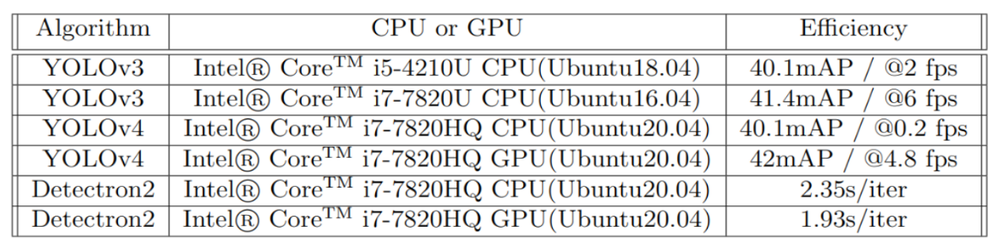

# Occlusion-Avoidance-and-DL-for-Tracking
Math Model for Time of Occlusion and Tracking by Deep Learning (Multi-Object Tracking Problem)

**Contents**

* [Introduction](#Introduction)
* [Abstract](#Abstract)
* [Highlights](#Highlights)
* [Prerequisites](#prerequisites)
* [Working](#working)
* [Results](#Results)

### Introduction
This repository contain the internship work on "Vision based Multi-robot Tracking of Target with Aerial and Ground Robots". This work is carried at LAAS-CNRS, Toulouse, France as a part of my Master thesis internship  2020 under the supervision of Prof. Antonio Franchi in coordination with Mr.Martin Jacquet(PhD) within ANR Project MuroPhen. This project is licensed under the terms of the BSD 3-Clause.

### Abstract
Recent research in Aerial Robotics defines Visual Tracking Methods deployed on Quadrotors. The idea is to study the existing state-of-the-art real time track-
ing algorithms and free to adopt the existing ones considering the problem of occlusion avoidance. Occlusions are mostly unpredictable and still ongoing re-
search in tracking scenarios. The inability to track the object’s features when some obstacle is encountered in between the camera field of view and moving
target are usually termed as ’Phenomenon of Occlusion’. The physical world obstacles causing these phenomenon are called ‘Occlusions’. Basically, occlusions
are two types. One is Spatio-temporal: No occlusion, partial occlusion & full occlusion. Other one is Time sequences based: Regular time occlusions and Irregular time occlusions.

Deploying a tracking algorithm considering the Occlusion Avoidance is a challenging task. This will include exploitation of the following parameters: geometric, photo-metric, motion, time, camera, feedbacks, control loops, real time stability, sensors, UAV dynamics etc. One has to build his own environment and
the required dataset in indoor or outdoor arena allotted to him. This work states the novel & spanking new solution for Occlusion Aviodance through the Time of
Occlusion concept to drive or navigate or control the UAV in the 3D environment. Then after deploy the tracking algorithm for tracking the moving target. Deep
Learning Tools are observed as profound methods and provide effective results (enabling optimization efficiently).

After a rigorous study of 10 Standard Robotic papers and over 20 papers on state-of-the-art Deep Neural Networks, the latest evolutions like YOLO, RetinaNet and Joint Monocular 3D Tracking surely believed to be future milestones upon using these tracking networks on Aerial Vehicles. Each one of them is expected to do potentially well & therefore these algorithms are tested and reported with qualitative results.

### Highlights:
1. A Novel Math Model development: Refer chapter-3 in this **[thesis](https://github.com/vamshikodipaka/Occlusion-Avoidance-and-DL-for-Tracking/blob/master/MSC%20Thesis/msc_thesis_vamshi.pdf)** document or slide no.8 & 9 from the thesis **[ppt](https://github.com/vamshikodipaka/Occlusion-Avoidance-and-DL-for-Tracking/blob/master/MSC%20Thesis/MSC%20Presentation%20Vamshi.pdf)**
2. Tracking by Deep Learning Models: YOLOv3, YOLOv4 and Detectron2
3. Use of GPU with CUDA, CuDNN
4. Tuning YOLO and Detectron2 to Depth based Tracking system

### Prerequisites
#### YOLOv3:
* Transfer Learning – pre-trained net, pretrained weights, predef-annotations
* TensorFlow 1.15, Keras 2.2.4, Numpy 1.16, Opencv 3.6.9,python 3.2.4.17
* batch size: 8 (can be 8 or 32). Batch Norm Epsilon= 1e-5, leaky ReLU=0.1, anchor boxes - 9 no.s, epoches: CPU
* Backbone: Darknet-53 residual connections, 72 Conv. Layers, Upsample layer, Non-max suppression
* COCO Dataset: 80 classes
#### YOLOv4:
* Opencv>=2.4, intel i7, cmake>=3.8 (3.10.2), openmp, git, g++,
* darknet backbone, for GPU usage: CUDA 10.0, CuDNN >=7.0
#### Detectron2:
* RetinaNet includes mask RCNN
* Written in Python - powered by Pytorch
* Uses COCO Dataset
* Multiple Networks grouped
* python>=3.6, Pytorch>=1.4, torchvision, pycocotools,
* opencv-python, opencv>=4, gcc>=5, CUDA 10.1, CuDNN >=7.0

### Working
#### a. Run YOLOv3 webcam based tracking (image_detect.py  is the main file)
1. Clone this repo. Download YOLOv3 weights from YOLO website, 
   or use: wget https://pjreddie.com/media/files/yolov3.weights
2. Copy downloaded weights file to model_data folder.
3. Convert Darknet YOLO to Keras:
   python convert.py model_data/yolov3.cfg model_data/yolov3.weights model_data/yolo_weights.h5
4. Test YOLO v3 with image_detect.py or realtime_detect.py (modify used model and classes according to your needs)
   1. output of YOLOv3 CPU my PC found here: **[Available here-1](https://youtu.be/J-xz2tQTK1c)**
   2. output of YOLOv3 CPU LAAS PC found here: **[Available here-2](https://youtu.be/ytDOpJ9F0mc)**

#### b. Run YOLOv4 and Detectron2 webcam based tracking (all tested on LAAS PC)
1. for YOLOv4 webcam object tracking - follow the commands instructed in 'history linux20' file
   1. output of YOLOv4 CPU found here: **[Available here-3](https://youtu.be/RpzwnDiODpA)**
   2. output of YOLOv4 GPU found here: **[Available here-4](https://youtu.be/06AHNylwcoo)**
2. for Detectron2 webcam object tracking - follow the commands instructed in 'history linux20' file
   1. output of Detectron2 CPU found here: **[Available here-5](https://youtu.be/rZjaWulg4lQ)**
   2. output of Detectron2 GPU found here: **[Available here-6](https://youtu.be/LFksvpn_jSs)**

Thanks to YOLOv4 and Detectron2 software, they are cloned as it is.

Their installations are adopted to our PC configurations in proper way and then it was magic. 

### Results
1. Please refer our Time of Occlusion Formulation available as case1 and case2 in Chapter-3 of Msc **[Thesis](https://github.com/vamshikodipaka/Occlusion-Avoidance-and-DL-for-Tracking/blob/master/MSC%20Thesis/msc_thesis_vamshi.pdf)** Report 
2. The YOLOv3, YOLOv4 and Detectron2 are tested on various PC configurations using webcam

MSC Thesis Defended on 06 July 2020

### Future Work
1. Tuning YOLO and Detectron2 to Depth based Tracking using "Triangle similarity technique"
2. Implementing the software on Robotic platforms
(Under construction)

-----------

### Obstacle Avoidance Testing (Part-2)
1. Drone Simulation uses ROS, Gazebo, Ardupilot, mavros, mavlink,darknet-ros packages
2. Output : Drone Flight Simulation with ros-webcam video "Sim4.mp4" is **[Available here](https://youtu.be/dP2IDDWtQfU)**

Object Detection work in progess ... (in ROS-Gazebo-DroneFlightSimulation)
